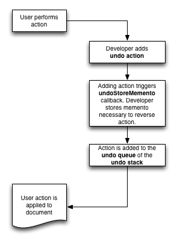
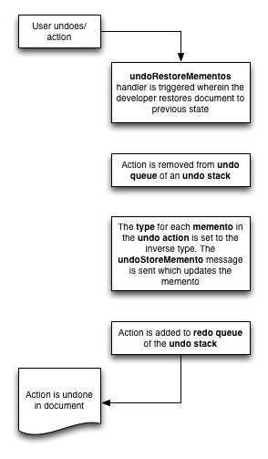

# Undo Manager

Levure provides your LiveCode application with a preferences management system.

On Macintosh OS X an external is used so you can set preferences using the OS X APIs. On Windows, Linux, iOS, and Android preferences are stored in a file containing data serialized using arrayEncode.

## Contents

* [Activate the Undo Manager framework helper](#activate-the-undo-manager-framework-helper)
* [Important terms](#important-terms)
* [How the Undo Manager works](#how-the-undo-manager-works)
* [API](#api)

## Activate the Undo Manager framework helper

To add the Undo Manager helper to your application add it under the `helpers` section of the `app.yml` file:

```
# app.yml

helpers:
  - folder: ./helpers
  - filename: "[[FRAMEWORK]]/helpers/undo_manager"
```

## Important terms

### Undo stack

An undo stack is a queue of undo actions. An application can have one or more undo stacks depending on the need. For example, an application that supports multiple document editors would use a different undo stack for each document editor window.

### Undo queue

Each undo stack has an undo queue which consists of the undo actions that can be undone. When an undo action is undone it is moved to the redo queue.

### Redo queue

Each undo stack has a redo queue which consists of the undo actions that can be redone. When an undo action is redone it is moved to the undo queue.

### Undo action
An undo action represents an action that the user performed that can be undone or redone. Undo actions are of a specific type and can have a memento associated with them.

### Memento array

A memento array is the array containing the information necessary to reverse an undo action (or at least part of it). Each memento array has at a minimum a `type` key and one other key. A simple memento array containing an id would look like this:

```
local tMementoA

put "delete" into tMementoA["type"]
put 35 into tMementoA["id"]
```

### Memento array types

Each memento array must have a `type` key. The `type` tells the `undoStoreMemento` message what type of memento to store.

By default the Undo Manager defines three types that you can assign to a memento array.

1. `create`
2. `delete`
3. `update`

Each type has an inverse type. When calling `undoUndo` and an undo action is processed the action is moved from the undo queue to the redo queue and the memento array action is changed to the inverse type. This allows the action to be redone. By default the following inverse types are defined:

| Type | Inverse Type |
| --   | --           |
| create | delete |
| delete | create |
| update | update |

### Undo action mementos

Each undo action has a "mementos" property which is a numerical indexed array. Each numeric element is a memento array. The undo action `mementos` key must have at least one memento array. A simple `mementos` key with one memento array would be constructed thusly:

```
local tMementosA, tMementoA

put "delete" into tMementoA["type"]
put 35 into tMementoA["id"]

put tMementoA into tMementosA[1]
```

## How the Undo Manager works

The Undo Manager helper provides an API that coordinates the storing and processing of undo and redo actions in your application. The helper DOES NOT provide the actual logic for performing the undo or redo operation. That job falls upon you the developer as undo actions will be specific to your application.

What the helper does do is manage undo actions. Here is a description of the life of an undo action:

1. When the user performs an action the developer adds an undo action to an undo stack. The undo action has a barebones `mementos` key associated with it.
2. The `undoStoreMemento` message is dispatched to `the target`, once for each memento array in the `mementos` of the undo action, when an undo action is added. In the `undoStoreMemento` handler the developer generates the memento necessary to reverse the action. The Undo Manager will store this memento for use later on.
3. When the user chooses to undo an action and `undoUndo` is called the Undo Manager dispatches `undoRestoreMementos` to `the target`. The message handler is responsible for using the undo action's mementos to restore the application to the correct state. The undo action is moved to the redo queue and each memento is assigned the inverse of it's current `type`. E.g. if the memento's type is `create` then it would be set to `delete`.

Here are some diagrams showing what happens when adding an undo action and undoing an action.

### Adding an undo action to an undo stack



### Undoing an action



## Storing mementos

Each time the user performs an action that can be undone the developer adds an undo action to an undo stack. The undo action has one or more mementos associated with it. These mementos are stored in the `mementos` key of an undo action. The `mementos` key is a numerically indexed array where each index is a `memento` array which has the information necessary to reverse the action. For example, if you created a new object then you probably need one memento array that has the information needed to delete that object if the user decides to undo the action.

Mementos for an undo action will be populated primarily in the `undoStoreMemento` handler. However, you do need to provide some basic information about the undo action mementos when you call `undoAddAction`.

An undo action is added to the undo queue using the `undoAddAction` command. The undo action can then be processed when the user undoes or redoes the action. Each time the the user undoes or redoes the action the undo action memento(s) needs to be updated. Because of this need to update the memento(s) throughout the life of the undo action the memento(s) is updated using the `undoStoreMemento` callback.

The `undoStoreMemento` callback is first called by `undoAddAction`. The callback will subsequently be called when calling `undoUndo` and `undoRedo`. The mementos array that you pass to `undoAddAction` should containt the minimum amount of information necessary for `undoStoreMemento` callback to store the actual memento. For example, you could just pass in a reference to a LiveCode control if you are changing properties on the control. The `undoStoreMemento` callback would use the control reference to store the current state of the properties.

## Restoring mementos

When you call `undoUndo` or `undoRedo` then the mementos stored for the most recent undo action will be used to reverse the action in the application. The `undoRestoreMementos` will be dispatched to `the target` and the memento array(s) can be used to update the application state.

## An example

Now that you have a foundational understanding of how the Undo Manager works, let's look at an example.

Here is an example of how you would add a single memento array to an undo action to an undo stack.

```
# Application creates new content. New content id is placed in tContentIds variable
...

# Create the memento array used to reverse the undo action. Since the code is creating content the
# memento array will use the `delete` type. Store the minimum amount of information
# that the `undoStoreMemento` callback will need to fill in the memento.
# In this case the callback just needs the id of the content that was created.
local tMementoA, tMementosA

put "delete" into tMementoA["type"]
put tContentIds into tMementoA["ids"]

put tMementoA into tMementosA[1]

# Add the undo action with the memento to the undo stack. The label in the Undo menu is "Undo Add Content".
undoAddAction "document 1", "Add Content", tMementosA
```

No that an undo action has been added to the "document 1" undo stack, let's look at the code that fills in the memento array. The memento is filled in based on the action being performed. As you look at the code below keep in mind that after a user undoes an action the user then has to be able to redo the action. The `undoStoreMemento` callback will need to be able to create mementos for both undo and redo requests. Also note that the `pUndoObjectA` parameter is passed in by reference. The callback will be updating the memento array(s) and the Undo Manager will store any modifications made to the parameter. `pUndoObjectA` will be passed to `undoRestoreMemento` later on.

**Important!** Be aware of when you are calling `undoAddAction` in your code. If the user is deleting an object and you delete the object before calling `undoAddAction` then your application may not be able to generate a memento because the object doesn't exist. In such cases call `undoAddAction` before you delete the object. If an error occurs while deleting the object you can use `undoRemoveLatest` to remove the undo action from the undo stack.

```
command undoStoreMemento @pMementoA
  local i

  switch pMementoA["type"]
    case "create"
      # Add keys to memento array necessary to recreate the content.
      _StoreMementoForCreate pMementoA
      break

    case "delete"
      # Add keys to memento array that will be required to delete it.
      _StoreMementoForDelete pMementoA
      break

    case "update"
      # Add keys to memento array that will allow the code to restore properties.
      _StoreMementoForUpdate pMementoA
      break

  end switch
end undoStoreMemento


private command _StoreMementoForCreate @pMementoA
  # TODO: Add keys to pMementoA necessary to recreate the content.
end _StoreMementoForCreate


private command _StoreMementoForDelete @pMementoA
  # TODO: Add keys to pMementoA that will be required to delete the content.
end _StoreMementoForDelete


private command _StoreMementoForUpdate @pMementoA
  # TODO: Add keys to pMementoA that will allow the code to restore properties.
end _StoreMementoForUpdate


command undoRestoreMementos @pMementosA
  lock screen

  # Use the information in the mementos to reverse the action and update the UI.
  repeat with i = 1 to the number of elements of pMementosA
    switch pMementosA[i]["type"]
      case "create"
        # Recreate the content and update the UI
        ...
        break

      case "delete"
        # Delete the content and update the UI
        ...
        break

      case "update"
        # Update the content and update the UI
        ...
        break

    end switch
  end repeat

  unlock screen
end undoRestoreMementos
```

**Of interest:** When moving an undo action from the undo queue to the redo queue (or vice versa) the Undo Manager reverses the sequence of elements in the `mementos` array. For example, if you pass in two memento arrays when creating an undo action then key "2" will become key "1" and key "1" will become key "2" when the undo action is moved to the redo queue.

<br>

## API
